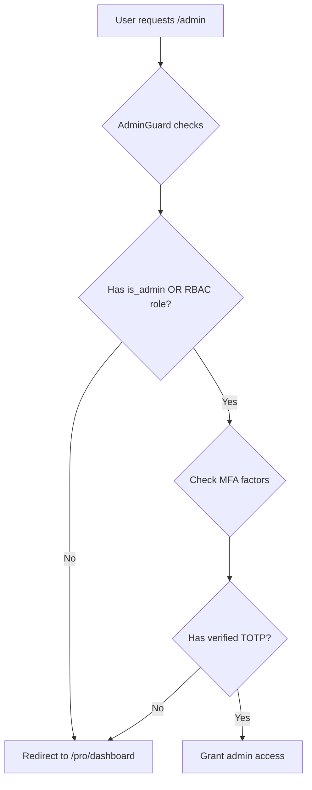

# Admin Panel Access - MFA Setup Guide

## Problem
After being granted admin access (via `is_admin = true` in profiles table or RBAC roles), you cannot access the admin panel and are redirected to `/pro/dashboard`.

## Root Cause
**MFA (Multi-Factor Authentication) is mandatory for all admin users.** The `AdminGuard` component enforces this requirement (see [src/components/guards/AdminGuard.tsx](file:///Users/vladimirv/Desktop/Owebale/src/components/guards/AdminGuard.tsx#L44-L61)).

### Why MFA is Required
- **Security Best Practice**: Protects privileged admin accounts from unauthorized access
- **Compliance**: Meets SOC 2 Type II requirements for administrative access
- **Risk Mitigation**: Prevents account takeover even if credentials are compromised

## Solution: Enable Two-Factor Authentication

### Step-by-Step Instructions

#### 1. Navigate to Security Settings
1. Sign in to your account
2. Go to **Settings** → **Security** (`/pro/settings?tab=security`)
3. Scroll to **"Two-Factor Authentication"** section

#### 2. Start MFA Enrollment
1. Click the **"Enable Two-Factor Authentication"** button
2. A QR code will appear on screen

#### 3. Set Up Authenticator App
You have two options:

**Option A: Scan QR Code (Recommended)**
1. Open your authenticator app:
   - Google Authenticator (iOS/Android)
   - Authy (iOS/Android/Desktop)
   - 1Password (iOS/Android/Mac/Windows)
   - Microsoft Authenticator
2. Tap "Add Account" or "+" button
3. Select "Scan QR Code"
4. Point your camera at the QR code on screen

**Option B: Manual Entry**
1. If you can't scan, click the copy icon next to the secret key
2. In your authenticator app, select "Enter setup key manually"
3. Paste the secret key
4. Give it a name (e.g., "Oweable Admin")

#### 4. Verify Setup
1. Your authenticator app will now show a 6-digit code that changes every 30 seconds
2. Enter the current 6-digit code in the input field
3. Click **"Verify & Enable"**
4. You should see a success message: "Two-factor authentication enabled successfully!"

#### 5. Access Admin Panel
1. After enabling MFA, navigate to `/admin` 
2. You should now have access!
3. You'll see: "✓ Admin panel access granted" in the Security settings

---

## How It Works

### Technical Flow



### AdminGuard Logic ([src/components/guards/AdminGuard.tsx](file:///Users/vladimirv/Desktop/Owebale/src/components/guards/AdminGuard.tsx))

1. **Authentication Check**: Verifies user is signed in
2. **Admin Role Check**: Checks either:
   - Legacy `profiles.is_admin = true`, OR
   - RBAC role (`admin` or `super_admin` in `admin_user_roles`)
3. **MFA Verification**: Requires verified TOTP factor via `supabase.auth.mfa.listFactors()`
4. **Access Decision**: Only grants access if ALL checks pass

### MFA Enrollment Process ([src/pages/settings/SecurityPanel.tsx](file:///Users/vladimirv/Desktop/Owebale/src/pages/settings/SecurityPanel.tsx))

1. **Enroll Factor**: Calls `supabase.auth.mfa.enroll({ factorType: 'totp' })`
2. **Display QR Code**: Shows Supabase-generated QR code and secret
3. **User Scans**: User adds to authenticator app
4. **Verify Code**: Calls `supabase.auth.mfa.challengeAndVerify({ factorId, code })`
5. **Update State**: Sets `mfaEnabled = true` in UI

---

## Troubleshooting

### Issue: "Failed to start MFA setup"
**Possible Causes:**
- Already have MFA enabled (check if green checkmark shows)
- Network connectivity issues
- Supabase auth service temporarily unavailable

**Solution:**
1. Refresh the page
2. Check browser console for errors
3. Try again in a few minutes

### Issue: "Invalid code" during verification
**Possible Causes:**
- Code expired (TOTP codes change every 30 seconds)
- Time synchronization issue on device
- Entered wrong code

**Solution:**
1. Wait for a new code to generate in your app
2. Ensure your device's time is set to automatic
3. Re-enter the current 6-digit code quickly
4. If still failing, cancel and restart enrollment

### Issue: Can't scan QR code
**Solution:**
- Use manual entry option (copy secret key)
- Ensure good lighting and camera focus
- Try a different authenticator app
- Zoom in on QR code if needed

### Issue: Lost access to authenticator app
**Current Limitation:** There's no backup/recovery mechanism implemented yet.

**Workaround:**
Contact the primary admin to temporarily disable MFA requirement (not recommended for production):
```sql
-- TEMPORARY: Only use in emergencies!
UPDATE profiles SET is_admin = false WHERE id = 'your-user-id';
-- Then re-enable after setting up MFA again
```

**Future Improvement Needed:** Implement backup codes or recovery flow.

### Issue: Using Google/SSO sign-in
**Important:** Even with Google sign-in, you **still need TOTP 2FA** for admin access. This is by design for defense-in-depth security.

The Security panel will show:
> ⚠️ Note: Since you use Google sign-in, you'll still need TOTP 2FA for admin access.

---

## For Administrators Granting Access

When promoting a user to admin, inform them:

```
Hi [Name],

I've granted you admin access to Oweable. To access the admin panel, you must first enable Two-Factor Authentication (2FA):

1. Go to Settings → Security
2. Click "Enable Two-Factor Authentication"
3. Scan the QR code with an authenticator app (Google Authenticator, Authy, etc.)
4. Enter the 6-digit code to verify
5. Once enabled, you can access /admin

This is a mandatory security requirement for all admin accounts.

Let me know if you need help!
```

### SQL to Grant Admin Access
```sql
-- Option 1: Legacy flag (simplest)
UPDATE profiles 
SET is_admin = true 
WHERE email = 'user@example.com';

-- Option 2: RBAC role (recommended for granular control)
INSERT INTO admin_user_roles (user_id, role_id)
SELECT 
  p.id,
  ar.id
FROM profiles p
CROSS JOIN admin_roles ar
WHERE p.email = 'user@example.com'
  AND ar.key = 'admin'; -- or 'super_admin'
```

---

## Security Notes

### What MFA Protects Against
✅ Phishing attacks  
✅ Credential stuffing  
✅ Password reuse attacks  
✅ Keyloggers  
✅ Database credential leaks  

### What MFA Doesn't Protect Against
❌ SIM swapping (if using SMS - we use TOTP so this doesn't apply)  
❌ Social engineering to bypass 2FA  
❌ Compromised authenticator app/device  

### Best Practices for Admin Users
1. **Use a reputable authenticator app** (Authy supports backups, Google Authenticator doesn't)
2. **Keep your device secure** with passcode/biometric lock
3. **Don't screenshot the QR code** or store the secret insecurely
4. **Test the setup** by signing out and back in
5. **Have a backup device** enrolled if possible (future feature)

---

## Future Enhancements

### Planned Improvements
- [ ] **Backup Codes**: Generate one-time use codes for recovery
- [ ] **Multiple Factors**: Allow enrolling multiple devices
- [ ] **Hardware Keys**: Support WebAuthn/FIDO2 security keys
- [ ] **Session Management**: Show active sessions and allow revocation
- [ ] **MFA Reset Flow**: Secure process for admins who lose access
- [ ] **Grace Period**: Temporary access while setting up MFA for new admins

### Implementation Priority
1. Backup codes (critical for recovery)
2. Multiple factor support (convenience)
3. Hardware key support (enhanced security)

---

## Related Documentation
- [Admin Panel Security Hardening](./ADMIN_PANEL_SECURITY_HARDENING_COMPLETE.md)
- [Admin Panel Code Audit](./ADMIN_PANEL_CODE_AUDIT.md)
- [Defensive Coding Audit](./DEFENSIVE_CODING_AUDIT_2026-04-30.md)

---

**Last Updated:** April 30, 2026  
**Status:** ✅ MFA Setup Complete  
**Build Status:** ✅ Passing
